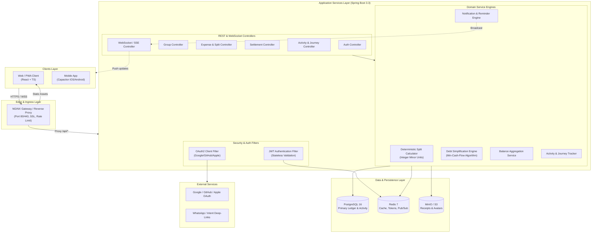
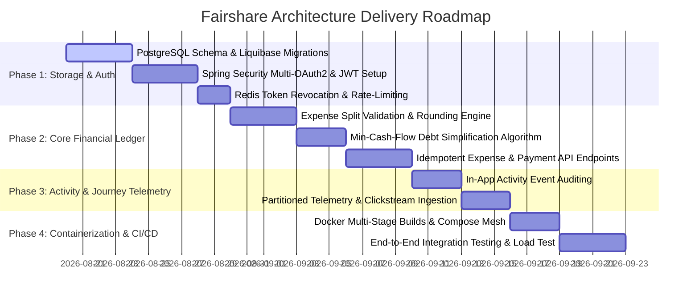

# Fairshare — High-Level Design (HLD) & Low-Level Design (LLD)

---

## 1. Executive Summary & Tech Stack Decisions

### 1.1 Tech Stack Recommendation Matrix

| Layer | Recommended Technology | Alternatives Considered | Rationale & Trade-offs |
| :--- | :--- | :--- | :--- |
| **Backend Framework** | **Java 21 + Spring Boot 3.3+** | Node.js (NestJS), Go, Python (FastAPI) | Enterprise-grade maturity, robust transaction management (`@Transactional`), type safety, Spring Security 6 ecosystem, out-of-the-box support for virtual threads (Project Loom) for high concurrency. |
| **Primary Database (Ledger & Core Entities)** | **PostgreSQL 16+** | MongoDB, MySQL, CockroachDB | **Strong ACID compliance is mandatory** for financial ledgers. Postgres provides row-level locking, transactional DDL, generated columns, constraints, JSONB for extensible receipt metadata, and CTEs for balance graph operations. |
| **User Journey & Activity Storage** | **Hybrid: PostgreSQL (Partitioned Audit Log) + Redis Buffer** *(Optional: ClickHouse at Scale)* | MongoDB, InfluxDB, TimescaleDB | **See Section 1.2 for detailed analysis.** Transactional user activity (who edited what expense) belongs in Postgres with foreign keys. High-volume analytics telemetry (clickstream/funnels) uses partitioned tables or a dedicated columnar store. |
| **In-Memory Cache & Message Broker** | **Redis 7+** | Memcached, RabbitMQ, Kafka | Used for distributed session tokens/denylists, idempotent request caching, API rate-limiting, and WebSocket Pub/Sub event broadcasting across backend nodes. |
| **Object Storage** | **MinIO (Local/Self-hosted) / AWS S3** | Local disk, GridFS | S3-compatible API for storing user avatars and receipt images with pre-signed upload URLs. |
| **Frontend Client** | **React 18 + TypeScript + Vite + Tailwind/Custom CSS** | Next.js, Vue, Angular | Existing codebase foundation with PWA and Capacitor mobile support for iOS and Android. |
| **Reverse Proxy & Gateway** | **NGINX / Caddy** | Traefik, Envoy, Spring Cloud Gateway | SSL termination, static asset serving, compression (gzip/brotli), rate-limiting, and reverse proxying to backend and frontend containers. |
| **Containerization & Orchestration** | **Docker & Docker Compose** *(Production: Kubernetes / Nomad)* | Raw VM systemd | Reproducible environments, single-command bootstrapping, multi-stage minimal build images. |

---

### 1.2 Database Dilemma: PostgreSQL vs MongoDB vs Time-Series DB

#### A. Core Financial Ledger Data: Why PostgreSQL Wins
Expense sharing requires absolute mathematical determinism:
- Every expense insertion must atomically insert entries into `expenses`, `expense_payers`, and `expense_shares`.
- $\sum \text{Paid} \equiv \sum \text{Owed} \equiv \text{Total Amount}$.
- Balance calculation (`Total Paid - Total Owed`) requires consistent joins across settled payments and shared expenses.
- **Why NOT MongoDB for Ledger**: MongoDB documents can model nested splits, but lack multi-collection relational integrity enforcement (foreign key cascades, cross-document `CHECK` constraints). In financial systems, eventual consistency or missing constraints can lead to ledger drift and rounding errors.

#### B. User Journey & Activity Feed: How to Model It Correctly
There are two distinct types of "User Journey" data:

```
                               ┌──────────────────────────────────────────────────────────┐
                               │                    User Event Sources                    │
                               └────────────────────────────┬─────────────────────────────┘
                                                            │
                            ┌───────────────────────────────┴───────────────────────────────┐
                            ▼                                                               ▼
        ┌───────────────────────────────────────┐                       ┌───────────────────────────────────────┐
        │       1. Transactional Activity       │                       │       2. Behavioral Telemetry         │
        │  (Expense added, group invite, edit)  │                       │  (Page views, clicks, dwell time)     │
        └───────────────────┬───────────────────┘                       └───────────────────┬───────────────────┘
                            │                                                               │
                            ▼                                                               ▼
        ┌───────────────────────────────────────┐                       ┌───────────────────────────────────────┐
        │  Storage: PostgreSQL (activity_events)│                       │  Storage: Redis Stream -> ClickHouse  │
        │  - Relational FK to User & Expense    │                       │  (or PostgreSQL Partitioned Table)    │
        │  - Query by group_id & user_id        │                       │  - Append-only, time-series OLAP      │
        │  - Part of application state          │                       │  - Funnel & journey analytics         │
        └───────────────────────────────────────┘                       └───────────────────────────────────────┘
```

1. **Transactional Activity Feed (In-App Activity)**:
   - *Examples*: "Alice added 'Dinner' for $60", "Bob settled up with Charlie".
   - *Requirement*: Needs relational consistency with users, groups, and expenses. Must update atomically inside the same transaction as the expense.
   - *Best Practice*: **PostgreSQL table (`activity_events`)** indexed on `(group_id, created_at DESC)` and `(user_id, created_at DESC)`.
2. **Behavioral Journey / Telemetry (Product Analytics)**:
   - *Examples*: User viewed group -> opened split modal -> switched split type to percentage -> abandoned.
   - *Requirement*: High write throughput, append-only, analytical aggregation over time.
   - *Best Practice*:
     - **Phase 1 (MVP to 100k users)**: Store in PostgreSQL using **Declarative Table Partitioning by Month** with JSONB payload.
     - **Phase 2 (Scale > 1M events/day)**: Stream via Redis Streams / Kafka into **ClickHouse** or **TimescaleDB**.
     - *Why NOT InfluxDB/Prometheus*: InfluxDB and Prometheus are optimized for numeric infrastructure metrics (CPU, memory, gauges, counters), not rich contextual JSON event streams with high cardinality (user IDs, path strings).

---

### 1.3 Authentication Strategy: Keycloak vs Spring Security OAuth2 Client

#### Comparison Matrix

| Factor | Option A: Native Spring Security 6 OAuth2 (Recommended) | Option B: Keycloak (Self-Hosted IAM) | Option C: Managed Auth (Auth0 / Supabase / Clerk) |
| :--- | :--- | :--- | :--- |
| **Architecture** | Embedded in Spring Boot API. Direct integration with Google, GitHub, Apple, and Email/Password. | Standalone identity server container (Keycloak Quarkus runtime + separate DB). | External 3rd-party SaaS identity platform. |
| **Resource Overhead** | **Zero extra infrastructure** (0 MB extra RAM). | **High** (~1 GB RAM, dedicated JVM, DB schema, key rotation cron). | Zero infrastructure, but paid tier costs scale with MAU. |
| **Multiple OAuth Handling** | `spring-boot-starter-oauth2-client` handles Google, Apple, GitHub via `application.yml` provider configs. User identity linked to single `user_id`. | Keycloak Identity Brokering automatically handles social logins and federation. | Handled by SaaS dashboard. |
| **Custom Business Logic** | Full programmatic control over user signup hooks, default currency assignment, invitation link acceptance. | Requires custom Keycloak SPI (Java plugins) or webhook listeners. | Webhooks / post-auth triggers. |
| **JWT & Session Flow** | Issues signed stateless JWTs (RS256 / EdDSA) with refresh tokens stored in Redis. | Issues Keycloak realm OIDC tokens verified by Spring Resource Server. | Issues SaaS tokens verified by public JWKS. |

#### Decision & Recommendation
- **Recommended Choice for Fairshare**: **Option A — Spring Security 6 with OAuth2 Client + Resource Server**.
  - Spring Boot 6+ natively supports multiple OAuth2 providers (Google, GitHub, Apple) simultaneously with simple configuration.
  - Keeps deployment lean and fast on Docker without spinning up a heavy Keycloak instance.
  - Provides direct relational access to link multiple OAuth provider IDs (`google_sub`, `github_id`, `apple_sub`) to a single internal `User` record.
- **When to switch to Keycloak**: Choose Keycloak only if you need enterprise SSO (SAML 2.0 / Active Directory), a separate admin delegation console, or multi-tenant corporate workforce management.

---

## 2. High-Level Design (HLD)

### 2.1 System Architecture Diagram



---

### 2.2 Core Modules & Responsibilities

1. **Auth & Identity Module**:
   - Manages user accounts, local bcrypt credentials, and OAuth2 identity linking (Google, GitHub, Apple).
   - Issues short-lived access tokens (15 mins) and sliding refresh tokens (30 days) stored in Redis with revocation capabilities.
2. **Expense & Ledger Module**:
   - Validates multi-currency and zero-sum allocations.
   - Enforces mathematical invariant: $\sum \text{Paid} == \sum \text{Owed} == \text{Total Amount}$.
   - Guarantees idempotent expense creation using `Idempotency-Key` headers.
3. **Debt Simplification & Balance Engine**:
   - Calculates pairwise balances across all participants in a group.
   - Executes the $O(N \log N)$ Min-Cash-Flow algorithm to simplify transitive debts (e.g., $A \to B \to C$ becomes $A \to C$).
4. **Activity & Journey Module**:
   - Records synchronous business events (audit trail) within the database transaction.
   - Ingests asynchronous client journey telemetries (button clicks, navigation steps) buffered in memory/Redis before batch insertion.
5. **Real-time Synchronization Module**:
   - Broadcasts real-time expense updates, balance recalculations, and group activity over WebSockets (STOMP over SockJS) backed by Redis Pub/Sub for horizontal scalability.

---

## 3. Low-Level Design (LLD)

### 3.1 Relational Database Schema (PostgreSQL DDL)

```sql
-- Enable UUID extension
CREATE EXTENSION IF NOT EXISTS "uuid-ossp";

-- 1. USERS & PROFILES
CREATE TABLE users (
    id UUID PRIMARY KEY DEFAULT uuid_generate_v4(),
    email VARCHAR(255) NOT NULL UNIQUE,
    password_hash VARCHAR(255), -- NULL if registered solely via OAuth
    name VARCHAR(100) NOT NULL,
    initials VARCHAR(10),
    avatar_url VARCHAR(512),
    color VARCHAR(32) DEFAULT '#6366F1',
    phone VARCHAR(32),
    instagram_handle VARCHAR(64),
    default_currency VARCHAR(3) NOT NULL DEFAULT 'USD',
    language VARCHAR(10) NOT NULL DEFAULT 'en',
    created_at TIMESTAMP WITH TIME ZONE NOT NULL DEFAULT CURRENT_TIMESTAMP,
    updated_at TIMESTAMP WITH TIME ZONE NOT NULL DEFAULT CURRENT_TIMESTAMP,
    version BIGINT NOT NULL DEFAULT 0
);

-- 2. USER FEDERATED IDENTITIES (For Multi-OAuth Support)
CREATE TABLE user_identities (
    id UUID PRIMARY KEY DEFAULT uuid_generate_v4(),
    user_id UUID NOT NULL REFERENCES users(id) ON DELETE CASCADE,
    provider VARCHAR(32) NOT NULL, -- 'google', 'github', 'apple'
    provider_user_id VARCHAR(255) NOT NULL,
    provider_email VARCHAR(255),
    created_at TIMESTAMP WITH TIME ZONE NOT NULL DEFAULT CURRENT_TIMESTAMP,
    CONSTRAINT uk_provider_user UNIQUE (provider, provider_user_id)
);
CREATE INDEX idx_user_identities_user_id ON user_identities(user_id);

-- 3. GROUPS
CREATE TYPE group_kind AS ENUM ('trip', 'home', 'couple', 'other');

CREATE TABLE groups (
    id UUID PRIMARY KEY DEFAULT uuid_generate_v4(),
    name VARCHAR(120) NOT NULL,
    kind group_kind NOT NULL DEFAULT 'other',
    emoji VARCHAR(16) DEFAULT '💰',
    simplify_debts BOOLEAN NOT NULL DEFAULT TRUE,
    created_by UUID NOT NULL REFERENCES users(id),
    created_at TIMESTAMP WITH TIME ZONE NOT NULL DEFAULT CURRENT_TIMESTAMP,
    updated_at TIMESTAMP WITH TIME ZONE NOT NULL DEFAULT CURRENT_TIMESTAMP,
    version BIGINT NOT NULL DEFAULT 0
);

-- 4. GROUP MEMBERSHIP
CREATE TABLE group_members (
    group_id UUID NOT NULL REFERENCES groups(id) ON DELETE CASCADE,
    user_id UUID NOT NULL REFERENCES users(id) ON DELETE CASCADE,
    joined_at TIMESTAMP WITH TIME ZONE NOT NULL DEFAULT CURRENT_TIMESTAMP,
    role VARCHAR(20) NOT NULL DEFAULT 'member', -- 'admin', 'member'
    PRIMARY KEY (group_id, user_id)
);
CREATE INDEX idx_group_members_user ON group_members(user_id);

-- 5. EXPENSES (Immutable Header)
CREATE TABLE expenses (
    id UUID PRIMARY KEY DEFAULT uuid_generate_v4(),
    group_id UUID NOT NULL REFERENCES groups(id) ON DELETE CASCADE,
    description VARCHAR(255) NOT NULL,
    notes TEXT,
    category VARCHAR(64) NOT NULL DEFAULT 'General',
    currency VARCHAR(3) NOT NULL DEFAULT 'USD',
    amount_minor BIGINT NOT NULL CHECK (amount_minor > 0), -- Stored in minor units (e.g. cents)
    occurred_at TIMESTAMP WITH TIME ZONE NOT NULL DEFAULT CURRENT_TIMESTAMP,
    created_by UUID NOT NULL REFERENCES users(id),
    receipt_url VARCHAR(512),
    idempotency_key VARCHAR(64),
    created_at TIMESTAMP WITH TIME ZONE NOT NULL DEFAULT CURRENT_TIMESTAMP,
    updated_at TIMESTAMP WITH TIME ZONE NOT NULL DEFAULT CURRENT_TIMESTAMP,
    deleted_at TIMESTAMP WITH TIME ZONE, -- Soft delete support
    version BIGINT NOT NULL DEFAULT 0,
    CONSTRAINT uk_expense_idempotency UNIQUE (group_id, idempotency_key)
);
CREATE INDEX idx_expenses_group_occurred ON expenses(group_id, occurred_at DESC) WHERE deleted_at IS NULL;

-- 6. EXPENSE ALLOCATIONS (Payers & Shares)
CREATE TYPE allocation_type AS ENUM ('PAYER', 'SHARER');

CREATE TABLE expense_allocations (
    id UUID PRIMARY KEY DEFAULT uuid_generate_v4(),
    expense_id UUID NOT NULL REFERENCES expenses(id) ON DELETE CASCADE,
    user_id UUID NOT NULL REFERENCES users(id),
    type allocation_type NOT NULL,
    amount_minor BIGINT NOT NULL CHECK (amount_minor >= 0),
    created_at TIMESTAMP WITH TIME ZONE NOT NULL DEFAULT CURRENT_TIMESTAMP,
    CONSTRAINT uk_expense_user_type UNIQUE (expense_id, user_id, type)
);
CREATE INDEX idx_allocations_user_expense ON expense_allocations(user_id, expense_id);

-- 7. SETTLEMENT PAYMENTS
CREATE TABLE payments (
    id UUID PRIMARY KEY DEFAULT uuid_generate_v4(),
    group_id UUID NOT NULL REFERENCES groups(id) ON DELETE CASCADE,
    from_user_id UUID NOT NULL REFERENCES users(id),
    to_user_id UUID NOT NULL REFERENCES users(id),
    currency VARCHAR(3) NOT NULL DEFAULT 'USD',
    amount_minor BIGINT NOT NULL CHECK (amount_minor > 0),
    note VARCHAR(255),
    occurred_at TIMESTAMP WITH TIME ZONE NOT NULL DEFAULT CURRENT_TIMESTAMP,
    created_at TIMESTAMP WITH TIME ZONE NOT NULL DEFAULT CURRENT_TIMESTAMP,
    CONSTRAINT chk_payment_different_users CHECK (from_user_id <> to_user_id)
);
CREATE INDEX idx_payments_group ON payments(group_id, occurred_at DESC);

-- 8. TRANSACTIONAL ACTIVITY EVENTS (In-App Audit Trail)
CREATE TABLE activity_events (
    id UUID PRIMARY KEY DEFAULT uuid_generate_v4(),
    group_id UUID NOT NULL REFERENCES groups(id) ON DELETE CASCADE,
    actor_id UUID NOT NULL REFERENCES users(id),
    event_type VARCHAR(64) NOT NULL, -- 'EXPENSE_CREATED', 'EXPENSE_UPDATED', 'PAYMENT_RECORDED'
    target_id UUID, -- Reference to expense_id or payment_id
    payload JSONB NOT NULL DEFAULT '{}'::jsonb,
    created_at TIMESTAMP WITH TIME ZONE NOT NULL DEFAULT CURRENT_TIMESTAMP
);
CREATE INDEX idx_activity_group_time ON activity_events(group_id, created_at DESC);
CREATE INDEX idx_activity_actor ON activity_events(actor_id, created_at DESC);

-- 9. USER JOURNEY & TELEMETRY (Declarative Monthly Partitioning)
CREATE TABLE user_journey_events (
    id UUID NOT NULL DEFAULT uuid_generate_v4(),
    user_id UUID,
    session_id VARCHAR(64) NOT NULL,
    event_name VARCHAR(64) NOT NULL, -- 'page_view', 'split_mode_changed', 'reminder_clicked'
    screen_name VARCHAR(64),
    properties JSONB NOT NULL DEFAULT '{}'::jsonb,
    occurred_at TIMESTAMP WITH TIME ZONE NOT NULL DEFAULT CURRENT_TIMESTAMP,
    PRIMARY KEY (id, occurred_at)
) PARTITION BY RANGE (occurred_at);

-- Initial Partitions Example
CREATE TABLE user_journey_events_2026_08 PARTITION OF user_journey_events
    FOR VALUES FROM ('2026-08-01 00:00:00+00') TO ('2026-09-01 00:00:00+00');
CREATE TABLE user_journey_events_2026_09 PARTITION OF user_journey_events
    FOR VALUES FROM ('2026-09-01 00:00:00+00') TO ('2026-10-01 00:00:00+00');
CREATE INDEX idx_journey_session_time ON user_journey_events(session_id, occurred_at DESC);
```

---

### 3.2 Core Financial Algorithms & Business Logic

#### A. Deterministic Money Representation
- **Rule**: Float/Double arithmetic is strictly prohibited in financial calculation steps.
- All monetary amounts are represented as 64-bit integer minor units (e.g., $10.50 \to 1050\text{ cents}$, ¥1000 \to 1000\text{ yen}$).
- When splitting amounts with remainders (e.g., \$100.00 among 3 people $\implies 3334, 3333, 3333$), the integer remainder $R = \text{Total} - \sum \lfloor \text{Share}_i \rfloor$ is distributed 1 cent per person deterministically to the first $R$ participants.

#### B. Net Balance Formulation
For any user $u$ in group $G$:
$$\text{NetBalance}(u, G) = \sum \text{PaidAmounts}(u, G) - \sum \text{OwedAmounts}(u, G) + \sum \text{PaymentsReceived}(u, G) - \sum \text{PaymentsSent}(u, G)$$
- If $\text{NetBalance} > 0$: User is a **creditor** (is owed money).
- If $\text{NetBalance} < 0$: User is a **debtor** (owes money).
- $\sum_{u \in G} \text{NetBalance}(u, G) \equiv 0$ (Invariant).

#### C. Debt Simplification Algorithm (Min-Cash-Flow)

```java
package com.fairshare.domain.engine;

import java.util.*;

public class DebtSimplificationEngine {

    public record Debt(UUID fromUser, UUID toUser, long amountMinor) {}

    public static List<Debt> simplifyDebts(Map<UUID, Long> netBalances) {
        // Priority queues: Max-Heap for creditors, Min-Heap (inverted) for debtors
        PriorityQueue<UserBalance> creditors = new PriorityQueue<>((a, b) -> Long.compare(b.balance(), a.balance()));
        PriorityQueue<UserBalance> debtors = new PriorityQueue<>((a, b) -> Long.compare(a.balance(), b.balance()));

        for (Map.Entry<UUID, Long> entry : netBalances.entrySet()) {
            if (entry.getValue() > 0) {
                creditors.offer(new UserBalance(entry.getKey(), entry.getValue()));
            } else if (entry.getValue() < 0) {
                debtors.offer(new UserBalance(entry.getKey(), entry.getValue()));
            }
        }

        List<Debt> simplifiedDebts = new ArrayList<>();

        while (!creditors.isEmpty() && !debtors.isEmpty()) {
            UserBalance maxCreditor = creditors.poll();
            UserBalance maxDebtor = debtors.poll();

            long settleAmount = Math.min(maxCreditor.balance(), -maxDebtor.balance());
            simplifiedDebts.add(new Debt(maxDebtor.userId(), maxCreditor.userId(), settleAmount));

            long remainingCredit = maxCreditor.balance() - settleAmount;
            long remainingDebt = maxDebtor.balance() + settleAmount; // Note: maxDebtor is negative

            if (remainingCredit > 0) {
                creditors.offer(new UserBalance(maxCreditor.userId(), remainingCredit));
            }
            if (remainingDebt < 0) {
                debtors.offer(new UserBalance(maxDebtor.userId(), remainingDebt));
            }
        }

        return simplifiedDebts;
    }

    private record UserBalance(UUID userId, long balance) {}
}
```

---

### 3.3 REST API Endpoints Specification

| Method | Endpoint | Description | Headers / Auth |
| :--- | :--- | :--- | :--- |
| `POST` | `/api/v1/auth/register` | Email/Password Registration | Public |
| `POST` | `/api/v1/auth/login` | Local authentication -> returns JWT pair | Public |
| `POST` | `/api/v1/auth/oauth/{provider}/callback` | Exchanges OAuth auth-code for App JWT | Public |
| `POST` | `/api/v1/auth/refresh` | Refresh expired access token | `Bearer <RefreshToken>` |
| `GET` | `/api/v1/users/me` | Fetch active user profile and preferences | `Bearer <AccessToken>` |
| `GET` | `/api/v1/groups` | List current user's groups with aggregate balances | `Bearer <AccessToken>` |
| `POST` | `/api/v1/groups` | Create group | `Bearer <AccessToken>` |
| `GET` | `/api/v1/groups/{id}/balances` | Get group raw and simplified debt breakdown | `Bearer <AccessToken>` |
| `POST` | `/api/v1/groups/{id}/expenses` | Record new expense with split allocations | `Bearer <AccessToken>`, `Idempotency-Key` |
| `PUT` | `/api/v1/expenses/{id}` | Update expense (re-computes balances & audit event) | `Bearer <AccessToken>` |
| `DELETE`| `/api/v1/expenses/{id}` | Soft-delete expense | `Bearer <AccessToken>` |
| `POST` | `/api/v1/groups/{id}/payments` | Record settlement payment | `Bearer <AccessToken>` |
| `GET` | `/api/v1/groups/{id}/activity` | Fetch paginated group activity feed | `Bearer <AccessToken>` |
| `POST` | `/api/v1/telemetry/events` | Batch ingestion of user journey clicks/views | `Bearer <AccessToken>` / Anonymous Session |

---

## 4. Docker Deployment Architecture

### 4.1 Production Multi-Container Topology

```
+---------------------------------------------------------------+
|                       Docker Host                             |
|                                                               |
|  +---------------------------------------------------------+  |
|  |             nginx:alpine (Port 80, 443)                 |  |
|  | - Reverse Proxy, SSL, Gzip, Rate-Limiting               |  |
|  +------------+-----------------------------+--------------+  |
|               |                             |                 |
|               v                             v                 |
|  +-------------------------+   +-------------------------+    |
|  | fairshare-web (React)   |   | fairshare-api (Spring)  |    |
|  | (Static HTML/JS/CSS)    |   | (Java 21 JVM)           |    |
|  +-------------------------+   +------------+------------+    |
|                                             |                 |
|                        +--------------------+----+            |
|                        |                    |    |            |
|                        v                    v    v            |
|             +--------------------+ +-----------+ +----------+ |
|             | postgres:16-alpine | |  redis:7  | |  minio   | |
|             | (Data Volume)      | |  (Cache)  | | (Photos) | |
|             +--------------------+ +-----------+ +----------+ |
+---------------------------------------------------------------+
```

---

### 4.2 Complete Dockerfiles & Docker Compose

#### A. Spring Boot Backend Multi-Stage Dockerfile (`backend/Dockerfile`)
```dockerfile
# Stage 1: Build stage with Gradle/Maven caching
FROM eclipse-temurin:21-jdk-alpine AS builder
WORKDIR /workspace/app

COPY gradlew .
COPY gradle gradle
COPY build.gradle settings.gradle ./
RUN ./gradlew dependencies --no-daemon

COPY src src
RUN ./gradlew bootJar --no-daemon -x test

# Extract layers for optimal Docker layer caching
RUN java -Djarmode=layertools -jar build/libs/*.jar extract

# Stage 2: Runtime Minimal Distroless / JRE
FROM eclipse-temurin:21-jre-alpine
RUN addgroup -S appgroup && adduser -S appuser -G appgroup
USER appuser
WORKDIR /app

COPY --from=builder /workspace/app/dependencies/ ./
COPY --from=builder /workspace/app/spring-boot-loader/ ./
COPY --from=builder /workspace/app/snapshot-dependencies/ ./
COPY --from=builder /workspace/app/application/ ./

EXPOSE 8080
ENV JAVA_OPTS="-XX:+UseG1GC -XX:MaxRAMPercentage=75.0 -XX:+ExitOnOutOfMemoryError"

ENTRYPOINT ["sh", "-c", "java $JAVA_OPTS org.springframework.boot.loader.launch.JarLauncher"]
```

#### B. React Frontend Dockerfile (`Dockerfile.frontend`)
```dockerfile
# Stage 1: Build React/Vite app
FROM node:20-alpine AS builder
WORKDIR /app
RUN npm install -g pnpm

COPY package.json pnpm-lock.yaml ./
RUN pnpm install --frozen-lockfile

COPY . .
RUN pnpm build

# Stage 2: Serve static files with NGINX
FROM nginx:alpine
COPY --from=builder /app/dist /usr/share/nginx/html
COPY nginx.conf /etc/nginx/conf.d/default.conf
EXPOSE 80
CMD ["nginx", "-g", "daemon off;"]
```

#### C. Unified `docker-compose.yml`
```yaml
version: '3.8'

services:
  postgres:
    image: postgres:16-alpine
    container_name: fairshare-postgres
    restart: unless-stopped
    environment:
      POSTGRES_DB: fairshare_db
      POSTGRES_USER: fairshare_user
      POSTGRES_PASSWORD: secret_db_password
    volumes:
      - postgres_data:/var/lib/postgresql/data
      - ./init-scripts:/docker-entrypoint-initdb.d
    ports:
      - "5432:5432"
    networks:
      - fairshare-network
    healthcheck:
      test: ["CMD-SHELL", "pg_isready -U fairshare_user -d fairshare_db"]
      interval: 5s
      timeout: 5s
      retries: 5

  redis:
    image: redis:7-alpine
    container_name: fairshare-redis
    restart: unless-stopped
    command: ["redis-server", "--appendonly", "yes", "--requirepass", "secret_redis_password"]
    volumes:
      - redis_data:/data
    ports:
      - "6379:6379"
    networks:
      - fairshare-network
    healthcheck:
      test: ["CMD", "redis-cli", "-a", "secret_redis_password", "ping"]
      interval: 5s
      timeout: 3s
      retries: 5

  minio:
    image: minio/minio:latest
    container_name: fairshare-minio
    restart: unless-stopped
    command: server /data --console-address ":9001"
    environment:
      MINIO_ROOT_USER: minio_admin
      MINIO_ROOT_PASSWORD: minio_secret_key
    volumes:
      - minio_data:/data
    ports:
      - "9000:9000"
      - "9001:9001"
    networks:
      - fairshare-network

  backend:
    build:
      context: ./backend
      dockerfile: Dockerfile
    container_name: fairshare-backend
    restart: unless-stopped
    depends_on:
      postgres:
        condition: service_healthy
      redis:
        condition: service_healthy
    environment:
      SPRING_PROFILES_ACTIVE: prod
      SPRING_DATASOURCE_URL: jdbc:postgresql://postgres:5432/fairshare_db
      SPRING_DATASOURCE_USERNAME: fairshare_user
      SPRING_DATASOURCE_PASSWORD: secret_db_password
      SPRING_DATA_REDIS_HOST: redis
      SPRING_DATA_REDIS_PORT: 6379
      SPRING_DATA_REDIS_PASSWORD: secret_redis_password
      S3_ENDPOINT: http://minio:9000
      S3_ACCESS_KEY: minio_admin
      S3_SECRET_KEY: minio_secret_key
      JWT_SECRET: super_long_production_hmac_secret_key_minimum_256_bits
      OAUTH2_GOOGLE_CLIENT_ID: ${GOOGLE_CLIENT_ID}
      OAUTH2_GOOGLE_CLIENT_SECRET: ${GOOGLE_CLIENT_SECRET}
      OAUTH2_GITHUB_CLIENT_ID: ${GITHUB_CLIENT_ID}
      OAUTH2_GITHUB_CLIENT_SECRET: ${GITHUB_CLIENT_SECRET}
    networks:
      - fairshare-network

  frontend:
    build:
      context: .
      dockerfile: Dockerfile.frontend
    container_name: fairshare-frontend
    restart: unless-stopped
    depends_on:
      - backend
    ports:
      - "80:80"
    networks:
      - fairshare-network

networks:
  fairshare-network:
    driver: bridge

volumes:
  postgres_data:
  redis_data:
  minio_data:
```

#### D. NGINX Gateway Configuration (`nginx.conf`)
```nginx
server {
    listen 80;
    server_name localhost;

    # Gzip Compression
    gzip on;
    gzip_types text/plain text/css application/json application/javascript text/xml application/xml application/xml+rss text/javascript;

    # Frontend Single Page Application Routing
    location / {
        root /usr/share/nginx/html;
        index index.html index.htm;
        try_files $uri $uri/ /index.html;
    }

    # Reverse Proxy to Spring Boot API
    location /api/ {
        proxy_pass http://backend:8080/api/;
        proxy_http_version 1.1;
        proxy_set_header Host $host;
        proxy_set_header X-Real-IP $remote_addr;
        proxy_set_header X-Forwarded-For $proxy_add_x_forwarded_for;
        proxy_set_header X-Forwarded-Proto $scheme;
    }

    # WebSocket / Realtime Proxying
    location /ws/ {
        proxy_pass http://backend:8080/ws/;
        proxy_http_version 1.1;
        proxy_set_header Upgrade $http_upgrade;
        proxy_set_header Connection "Upgrade";
        proxy_set_header Host $host;
    }
}
```

---

## 5. Implementation Roadmap & Next Steps


