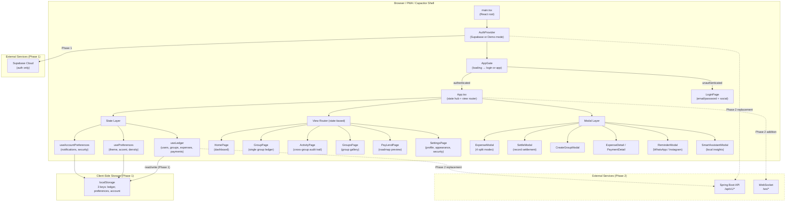
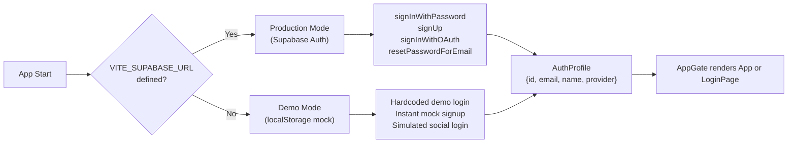

# Fairshare — Frontend High-Level Design (HLD)

---

## 1. Overview

Fairshare's frontend is a **React 19 + TypeScript PWA** that currently runs entirely client-side with local persistence. It is built with Vite, styled with hand-written CSS (no Tailwind), packaged for mobile via Capacitor, and authenticated via Supabase (or a local demo fallback).

**Phase 1** (backend development) makes zero changes to the frontend — it continues working as-is.
**Phase 2** will swap the data layer from `localStorage` to REST API calls and replace Supabase auth with Spring Boot JWT.

---

## 2. Tech Stack

| Layer | Technology | Notes |
|-------|-----------|-------|
| UI Framework | React 19.2 | Functional components, hooks only |
| Language | TypeScript 6 (strict mode) | `noUncheckedIndexedAccess: true` |
| Build Tool | Vite 8.2 | Dev server on `127.0.0.1:4173` |
| Icons | Lucide React | SVG icon library |
| CSS | Hand-written custom CSS | CSS variables, grid, dark mode, responsive |
| State | Custom React hooks + `localStorage` | No Redux/Zustand/Jotai |
| Routing | State-based (`useState<AppView>`) | No react-router |
| Auth | Supabase SDK (production) / Demo mode (local) | Dual-mode strategy |
| Mobile | Capacitor 8 | Android + iOS shells |
| PWA | Custom service worker + web manifest | Offline application shell |
| Testing | Vitest | Unit tests for domain logic |

**Notable absences**: No CSS framework (Tailwind, Bootstrap), no router library, no external state manager, no HTTP client library.

---

## 3. System Architecture



---

## 4. Data Flow

### Current (Phase 1) — Fully Local

```
User Action → React State Update → localStorage Write → UI Re-render
                                        ↓
                              Page Reload → localStorage Read → State Restored
```

All financial data (users, groups, expenses, payments) lives in a single `localStorage` key (`fairshare-ledger-v1`) serialized as JSON. The entire state object is overwritten on every mutation.

### Target (Phase 2) — API-Backed

```
User Action → API Call (fetch + JWT) → Server Response → React State Update → UI Re-render
                                                              ↓
                                                    Local cache for offline UX
```

```
Server Mutation (another user) → WebSocket Push → React State Update → UI Re-render
```

---

## 5. Routing Architecture

There is **no router library**. Navigation is controlled by a single `useState` in `App.tsx`:

```typescript
export type AppView = 'home' | 'expenses' | 'activity' | 'groups' | 'pay' | 'settings'
const [currentView, setCurrentView] = useState<AppView>('home')
```

| View | Page Component | Purpose |
|------|---------------|---------|
| `home` | `HomePage` | Dashboard: net position, groups overview, friends summary, recent expenses |
| `expenses` | `GroupPage` | Single group ledger with search, balance cards, settle plan, members |
| `activity` | `ActivityPage` | Cross-group chronological feed with filters |
| `groups` | `GroupsPage` | Gallery of all groups with summary stats |
| `pay` | `PayLendPage` | Future features preview (payment, voice, OCR) |
| `settings` | `SettingsPage` | Profile, notifications, appearance, security (4 tabs) |

Navigation is triggered by:
- `AppNavigation` — desktop sidebar
- `MobileNavigation` — bottom tab bar (< 768px)
- Contextual buttons/links within pages

---

## 6. Authentication Architecture

### Dual-Mode Strategy



### Supported Auth Methods
- **Email/Password**: Register + Login + Password Reset
- **Google OAuth**: `supabase.auth.signInWithOAuth({ provider: 'google' })`
- **Apple OAuth**: Same pattern
- **GitHub OAuth**: Same pattern

### Phase 2 Auth Change
Supabase will be replaced by direct Spring Boot JWT flow:
1. Frontend redirects to `GET /api/v1/auth/oauth/google`
2. Spring Boot handles the full OAuth handshake with Google
3. Spring redirects back to frontend with `accessToken` + `refreshToken`
4. Frontend stores tokens and uses `Bearer` header for all API calls

---

## 7. State Management

Three independent custom hooks, each backed by a `localStorage` key:

### 7.1 useLedger (`fairshare-ledger-v1`)
- **Data**: `LedgerState { currentUserId, users[], groups[], expenses[], payments[] }`
- **Operations**: `addExpense`, `updateExpense`, `deleteExpense`, `addPayment`, `updatePayment`, `deletePayment`, `addGroup`, `updateCurrentUser`, `resetDemo`
- **Initial load**: Reads from `localStorage`; falls back to seed data if empty/corrupt

### 7.2 usePreferences (`fairshare-preferences-v1`)
- **Data**: `AppPreferences { theme, accent, density, hideBalances, reduceMotion }`
- **Side effects**: Mutates `document.documentElement.dataset.*` attributes for CSS theming
- **Listens to**: `prefers-color-scheme` media query when `theme === 'system'`

### 7.3 useAccountPreferences (`fairshare-account-preferences-v1`)
- **Data**: `NotificationPreferences` + `SecurityPreferences`
- **Used by**: Notification panel filtering, delete confirmation guard

---

## 8. Domain Logic (Client-Side)

The frontend contains **production-grade financial math** that will NOT be replaced — it runs in parallel with backend validation for instant UX:

| Module | Responsibility |
|--------|---------------|
| `domain/money.ts` | Integer arithmetic: `parseMoney`, `formatMoney`, `splitEqually`, `splitByShares`, `splitByPercentages`, `validateExactSplit`, `calculateBalances`, `simplifyDebts` |
| `domain/types.ts` | All TypeScript interfaces: `User`, `Group`, `Expense`, `Payment`, `Allocation`, `Debt`, preferences |
| `lib/ledger.ts` | Utilities: `findUser`, `shortName`, `groupBalance`, `expenseUserNet`, category emoji map |
| `lib/smartInsights.ts` | Local analytics: spending breakdown, top categories, actionable suggestions |
| `lib/dates.ts` | Calendar headings, timezone-safe date formatting |

### Financial Invariant (enforced both client-side and server-side)
$$\sum \text{Paid} = \sum \text{Owed} = \text{Total Amount}$$

All amounts are **integers in minor currency units** (paise for INR, cents for USD). Deterministic largest-remainder rounding ensures split amounts sum exactly to the total.

---

## 9. Component Architecture

### Layout Structure (3-column CSS Grid)
```
┌──────────┬─────────────────────────┬──────────────┐
│ Sidebar  │   Main Content Panel    │  Details     │
│ (nav +   │   (selected page)       │  Panel      │
│  groups) │                         │ (settle,    │
│          │                         │  members)   │
└──────────┴─────────────────────────┴──────────────┘
            ↕ Below 768px: Bottom Tab Bar ↕
```

### Modal System
All modals are rendered at the root level of `App.tsx` and controlled via boolean state + selected entity state. They overlay the entire app with backdrop blur.

### Key Components
| Component | Purpose |
|-----------|---------|
| `AppNavigation` | Desktop sidebar with view links + group list |
| `MobileNavigation` | Bottom tab bar for mobile viewports |
| `AppTopbar` | Search input, notification bell, avatar menu |
| `ExpenseModal` | Full expense editor with 4 split modes |
| `SettleModal` | Settlement recorder with pre-filled amounts |
| `CreateGroupModal` | Group creation with emoji, kind, member selection |
| `ReminderModal` | WhatsApp/Instagram reminder with tone selection |
| `SmartAssistantModal` | Local analytics and actionable suggestions |
| `NotificationPanel` | In-app activity dropdown |
| `LedgerRows` | Expense/Payment row rendering with calendar headings |
| `Avatar` | User avatar with initials fallback |

---

## 10. Phase 2 Change Plan (Frontend ↔ Backend Integration)

### Files to Modify

| File | Change | Risk |
|------|--------|------|
| `auth/AuthProvider.tsx` | Replace Supabase calls with Spring Boot JWT endpoints | Medium — core auth flow |
| `auth/types.ts` | Add `msisdn` field, update provider types | Low |
| `store/useLedger.ts` | Replace localStorage with API fetch + local cache | High — all data flow |
| `domain/types.ts` | Add `Contact`, `UpcomingBill`, `MoneyRequest` interfaces | Low — additive |
| `.env.example` | Replace Supabase vars with `VITE_API_BASE_URL` | Low |

### Files to Create

| File | Purpose |
|------|---------|
| `lib/api.ts` | Typed `fetch` wrapper with JWT headers |
| `lib/ws.ts` | WebSocket client (STOMP/SockJS) |
| `pages/ContactsPage.tsx` | MSISDN-based contact management |
| `pages/UpcomingBillsPage.tsx` | Due bills tracker |
| `pages/MoneyRequestsPage.tsx` | Request tracker with expiry |
| `pages/OnboardingPage.tsx` | Multi-step first-time journey |

### Files to Delete

| File | Reason |
|------|--------|
| `auth/supabase.ts` | Replaced by `lib/api.ts` + Spring Boot auth |

### Files Preserved (ZERO changes)

| File(s) | Reason |
|---------|--------|
| `domain/money.ts` | Financial math stays client-side for instant UX |
| All `components/*.tsx` | UI layer unchanged |
| All existing `pages/*.tsx` | Existing pages work as-is |
| `styles.css` | All styling preserved |
| `lib/dates.ts`, `lib/ledger.ts`, `lib/smartInsights.ts` | Utilities preserved |
| `data/seed.ts` | Kept for demo/offline mode |
| `hooks/useMinuteClock.ts` | Clock utility preserved |

---

## 11. Non-Functional Requirements

| Aspect | Current State | Target |
|--------|--------------|--------|
| **Offline** | Full offline via localStorage | Offline read from cache, queue writes |
| **Performance** | Instant (no network) | Optimistic updates + API sync |
| **Accessibility** | Focus rings, sr-only, reduced motion | Maintained |
| **Bundle Size** | ~5 deps, no heavy framework | Keep minimal |
| **Mobile** | Responsive CSS + Capacitor | Maintained |
| **PWA** | Service worker + manifest | Maintained |
